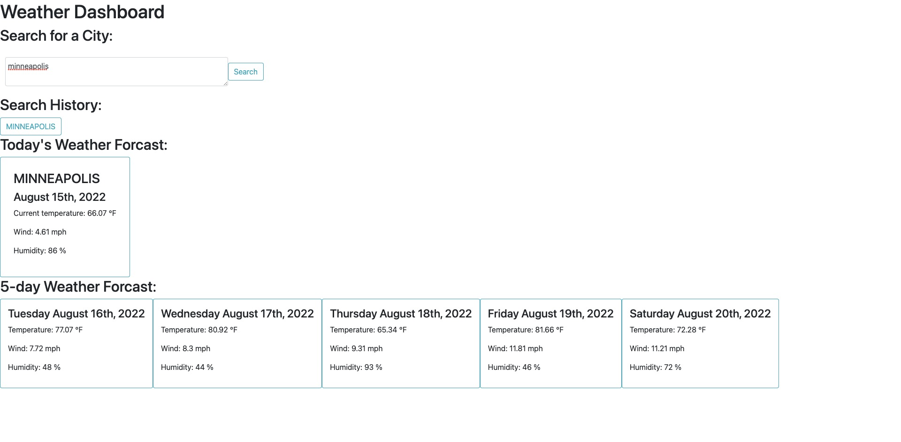

# module-6-weather-dashboard

## Overview

In preparation for an up coming trip, I created a weather outlook for multiple citys so I can view the weather and plan accordingly

## Installation:

1. `git clone git@github.com:PDKetchum/module-6-weather-dashboard.git`
2. Open `index.html`

## How to use:

- Type in your appointment
- Click save to store in scheduler
- To remove an appointment, delete text and click save

Hosted: https://pdketchum.github.io/module-6-weather-dashboard/

GitHub URL: https://github.com/PDKetchum/module-6-weather-dashboard

_Screenshot of page_
